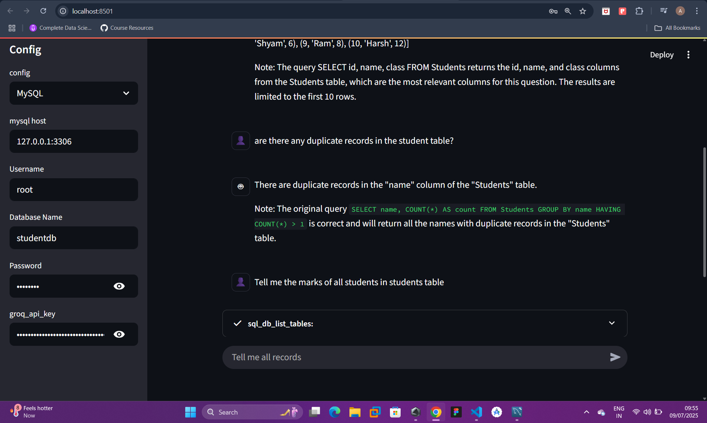

# AskSQL

AskSQL is a project that uses the SQL toolkit from the LangChain community to let users interact with SQL databases using natural language — eliminating the need to write complex queries manually. The goal is to simulate a human-like conversational environment over your database.

---

## 🧐 Tech Stack

* `langchain.sql_database.SQLDatabase` – for DB abstraction and query handling.
* `sqlalchemy.create_engine` – to connect with SQLite and MySQL.
* `pathlib` – for working with local SQLite file paths.
* `streamlit` – for building the frontend interface.

---

## 🚀 Features

* Natural language query interface over SQL databases.
* Supports both **SQLite** and **MySQL**.
* Easy configuration via Streamlit sidebar.
* Utilizes **LangChain's SQL Toolkit** with a Groq-hosted LLM (Llama3-8b-8192).
* Uses `streaming=True` to improve response latency and user experience.

---

## 🔄 Streaming Explained

**`streaming=True`** enables token-by-token streaming of the LLM's output:

* Sends output chunks (tokens) as they are generated instead of waiting for the entire response.
* Improves perceived latency.
* Ideal for chatbots or assistants in Streamlit or terminal.

---

## 📂 Database Connectivity

Learned to create connection objects for both **SQLite** and **MySQL** using:

* `SQLDatabase` from `langchain.sql_database`
* `create_engine` from SQLAlchemy
* `@st.cache_resource(ttl='2h')` for caching DB connection in Streamlit

---

## 📅 UI Preview

